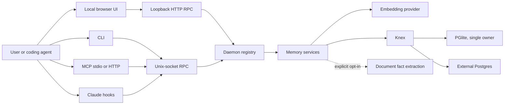
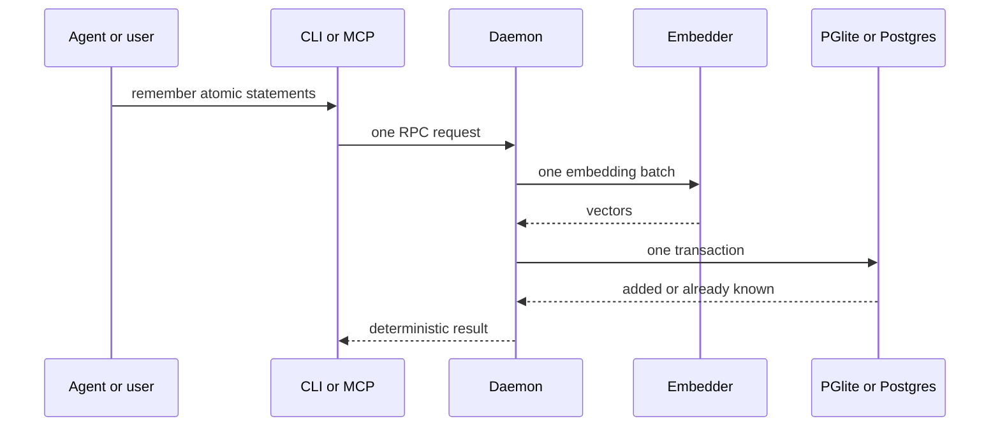
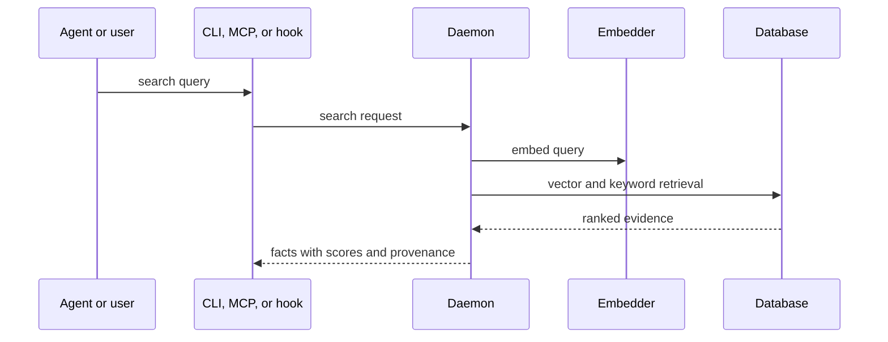

# Sigil Architecture Blueprint and Optimization Record

Generated: 2026-07-23
Branch: `codex/sigil-core-simplification`
Status: Complete, core simplification and onboarding-hardening phases verified

## Product standard

Sigil exists to give a person one dependable memory store that works across AI
coding agents. Most users run it on one machine. Their primary jobs are:

1. Save a durable statement intentionally.
2. Retrieve the right statements quickly in a later agent session.
3. Keep all memory and credentials under their control.
4. Install and recover the system without understanding its internals.
5. Avoid hidden LLM calls, background agent sessions, runaway processes, and
   database corruption.

Features are not retained because they sound intelligent. A feature stays only
when it improves one of these jobs enough to justify its runtime cost, failure
surface, setup burden, and maintenance cost.

## Non-negotiable invariants

- The default installation is local-first and single-device.
- Explicit save and retrieval require an embedding provider, not a generative LLM.
- No automatic flow may launch a coding-agent CLI session by default.
- PGlite has exactly one owning process.
- Provider work never runs while a database transaction is held.
- Search is read-only unless the user explicitly performs a write.
- Every stored memory is attributable, exportable, and deletable.
- A broken memory layer never blocks the user's coding agent.
- Optional capabilities cannot increase core startup work when disabled.
- Errors state what failed, why it failed, and the next corrective action.

## Current implementation baseline

Measured after the initial core-simplification patch and before the full audit.

| Metric | Baseline |
|---|---:|
| Source files excluding `dist/` and user `docs/` | 385 |
| JavaScript source files | 281 |
| Production JS/CJS lines | 31,657 |
| Test lines | 4,317 |
| Test files | 43 |
| Test cases detected statically | 276 |
| Database migrations | 38 |
| Total built JavaScript | 1,470,640 bytes |
| CLI bundle | 658,044 bytes |
| Daemon bundle | 500,539 bytes |
| Full non-network test result | 267 passed |
| Localhost MCP HTTP test result | 3 passed |
| Build | Passed |
| ESLint | Passed |

These numbers are tracking signals, not goals by themselves. Removing 1,000
lines is useful only when it also removes user-visible complexity or a failure
mode.

## Final optimized state

| Metric | Final | Change from baseline |
|---|---:|---:|
| Source files excluding `dist/` and user `docs/` | 290 | -95 (-24.7%) |
| JavaScript source files | 256 | -25 (-8.9%) |
| Production JS/CJS lines | 20,118 | -11,539 (-36.4%) |
| Test lines | 3,173 | Retired-feature tests removed; core boundary/integration coverage added |
| Test files | 41 | 2 fewer |
| Executed test cases | 190 | All passing |
| Database migrations | 38 | Unchanged for upgrade safety |
| Total built JavaScript | 958,045 bytes | -512,595 (-34.9%) |
| CLI bundle | 484,605 bytes | -173,439 (-26.4%) |
| Daemon bundle | 346,524 bytes | -154,015 (-30.8%) |
| Prompt hook bundle | 21,556 bytes | One bounded recall hook |
| Runtime dependencies | 5 required + 2 optional | Clean `npm ls` |
| Dependency audit | 266 packages, 0 vulnerabilities | Passed |
| Full regression | 190/190 across 41 files | Passed |
| Built CLI surface smoke | 21/21 help flows | Passed |

Across the tracked diff, 18,464 lines were removed and 2,538 were added: a net
reduction of 15,926 lines. The additions are primarily deterministic core
paths, ownership/recovery guards, boundary tests, explicit correction and
management operations, and this decision record.

## Detected architecture

Sigil is a Node.js monolith with several process entrypoints and a local RPC
boundary. Knex provides a common query layer over PGlite and server-backed
Postgres. The daemon is the sole embedded-database owner. CLI, hooks, MCP, and
the browser UI call into its registry.

### Layer map

| Layer | Current responsibility | Boundary quality |
|---|---|---|
| Entry points | CLI, daemon, MCP server, one prompt-recall hook | Small and purpose-specific after Phase 5 |
| Transport | Unix socket plus on-demand loopback HTTP/MCP/WebSocket | Local transports share one registry; browser transports are lazy |
| Application services | Daemon handlers and setup service | Core handlers only; optional generation stays behind explicit ingestion flags |
| Memory | facts, documents, chunks, namespaces, source provenance | One deterministic store and retrieval model |
| Persistence | Knex, PGlite adapter, Postgres drivers, 38 migrations | Common query layer is valuable; schema contains many inactive experiments |
| Providers | embeddings plus optional one-shot LLM APIs/Ollama/Claude CLI | Embeddings are core; generation is explicit and concurrency-bounded |
| Product surfaces | focused CLI, seven MCP tools, smaller on-demand GUI, generated agent instructions | Surfaces describe user jobs instead of internal cognitive machinery |

## Runtime flows

### Explicit save, target flow

No classifier, document parser, contextualizer, generative dedup judge, graph
extractor, session worker, or context snapshot belongs in this path.

### Retrieval, target flow

Retrieval must not update counters, build learned edges, or silently synthesize
an answer.

## Subsystem inventory and disposition hypothesis

The final disposition is decided only after its phase audit and tests.

| Subsystem | Approximate size | User value | Current cost/risk | Initial disposition |
|---|---:|---|---|---|
| Fact storage and explicit remember | Core | Essential | Previously routed through generation-heavy document ingestion | Kept and hardened in Phase 3: normalized exact dedup, one batch for new embeddings, atomic transactions, explicit correction |
| Vector + keyword search | 1,511 lines with optional layers at baseline | Essential | Routing, graph expansion, lifecycle weighting, and synthesis obscured the core | Kept as one query embedding plus vector/keyword RRF in Phase 4 |
| PGlite adapter and owner lock | Part of 3,448 DB lines | Essential for zero-prerequisite local setup | Single-process constraint caused recurring corruption and recovery code | Keep behind one thin owner |
| External Postgres drivers | Small | Needed by some advanced and multi-machine users | Adds configuration branches but little idle cost | Keep as advanced |
| Daemon and Unix RPC | 4,156 daemon lines at baseline | Required to serialize PGlite across agent processes | Registered UI, network, graph, connector, trace, and engine features at every boot | Keep; Phase 1 added lifetime ownership and lazy UI startup |
| Embedding providers | Small provider adapters | Essential | Setup/model mismatch and remote-provider egress | Keep, improve validation |
| Generative LLM providers | Roughly 1,000+ lines | Useful only for optional extraction/capture | API failures, cost, coding-agent session loops | Optional settings capability; removed from core onboarding and health requirements in Phase 2 |
| Managed coding-agent sessions | 1,714 lines at baseline | Unproven | tmux workers, warm sessions, fallback loops, RAM and CPU growth | Deleted in Phase 5; explicit optional generation is one-shot and concurrency-bounded |
| Automatic Stop capture | Hook plus classifier at baseline | Convenience for API/Ollama users | One generation call per turn and possible low-signal storage | Deleted in Phase 5; saving is explicit |
| Session summaries | LLM flow at baseline | Low incremental value | Hidden generation at session shutdown | Deleted in Phase 5 |
| PostToolUse capture | Retained dead implementation at baseline | Negative value | Polluted roughly 40% of prior knowledge bases | Deleted in Phase 5 with legacy hook cleanup during reconnect |
| Document ingestion | 1,680 ingestion lines | Useful for a minority with durable documents | Classify, contextualize, extract, graph, and re-embed fan-out | Kept as deterministic parse → chunk → embed → atomic replace; generation flags are explicit |
| AUDM generative decisions | Formerly in fact store and prompt | Unproven for routine saves | Hidden per-fact LLM calls and correction ambiguity | Removed in Phase 3; replaced with explicit append-only correction |
| Entity graph | 1,499 lines at baseline | No demonstrated lift after deterministic retrieval | Extraction calls, schema, UI, and many MCP tools | Runtime, APIs, prompts, tests, and UI deleted in Phase 5; migrations preserved |
| Cognitive query router | 430 lines at baseline | Marginal | One LLM call could precede every search | Deleted in Phase 4 |
| Fact and entity Hebbian systems | 602+ lines and two schema families at baseline | No demonstrated local-user value | Write amplification and self-reinforcing ranking | Runtime and maintenance command deleted in Phase 4; migrations preserved |
| ACT-R lifecycle stages | Lifecycle tables and ranking SQL | Weakly justified | Mutation, maintenance commands, opaque relevance | Removed from retrieval and runtime maintenance in Phase 4; historical schema preserved |
| Pods and five pod kinds | 1,562 lines at baseline | Internal ontology without a clear user job | Polymorphic membership, registries, schemas, many commands/tools | Deleted in Phase 5; namespaces and source provenance cover proven needs |
| Hot-context snapshot | Fact snapshot writer and client instructions | Fast fallback context | Staleness and a second memory representation | Deleted in Phase 4; preamble is health-only and recall is targeted |
| Connectors schema and setup step | Agent integration naming plus historical DB schema | Connecting coding agents is valuable; generic data connectors are not implemented | Ambiguous terminology | Kept only as the coding-agent connection flow; generic connector claims and metadata were removed in Phase 7 |
| Multi-device Iroh | 618 net lines plus handlers, CLI and schema at baseline | Low-demand advanced use | Native dependency, auth, pairing, modes, platform binaries, large failure surface | Runtime, pairing UI/CLI, handlers, and dependency deleted in Phase 5; migrations preserved |
| Trace/activity persistence | Handler, table, GUI views | Helpful for debugging | Stores large payloads and exposes internal complexity | Retain bounded operational diagnostics only |
| Local GUI | 2,531 JS lines plus HTML/CSS/vendor graph at baseline | Helpful for onboarding and inspecting memory | Formerly exposed graph, pods, devices, and engines | Kept as a smaller on-demand setup, fact, document, status, and diagnostic UI in Phase 5 |
| Supervisor and updater | About 1,600 combined lines | Needed for a dependable install | Platform branches and filesystem mutation | Keep, harden and simplify |
| Snapshots and non-destructive recovery | DB support | High value because PGlite failures lose trust | Background work and disk usage | Keep with explicit limits and tests |

## Architecture decisions

### ADR-001: Keep a thin daemon for embedded storage

**Context:** PGlite cannot safely be opened by multiple short-lived CLI, hook,
and MCP processes. Attempts to make every caller open the database independently
caused `Aborted()` failures and poisoned the live WASM instance.

**Decision:** Keep one daemon as the exclusive PGlite owner. Treat it as a local
storage adapter, not as an orchestration engine.

**Consequences:** CLI and MCP pay a small RPC hop. In exchange, one process owns
the database and recovery logic. Optional HTTP, GUI, generation, network, graph,
and managed-session systems must not become daemon startup requirements.

### ADR-002: Generation is optional enrichment

**Context:** Explicit memory storage and retrieval need embeddings. They do not
need a generative model.

**Decision:** Onboarding, doctor, explicit save, search, list, forget, export,
and database recovery must work without an LLM provider.

**Consequences:** Document extraction and automatic capture require explicit
enablement. Coding-agent CLI providers are never used automatically.

### ADR-003: Prefer explicit correction over inferred supersession

**Context:** Embedding similarity cannot reliably distinguish a paraphrase from
a contradiction. A hidden LLM judge adds cost and can still make the wrong call.

**Decision:** Routine save is append-only with deterministic duplicate handling.
Correction and replacement become explicit user operations with history.

**Consequences:** The API must expose a clear correction flow before legacy AUDM
can be deleted.

### ADR-004: Daemon safety uses a lifetime lock, not an always-on UI port

**Context:** The HTTP port was the only atomic startup resource. Disabling the
always-on GUI without replacing that role would allow two daemons to both pass
the liveness check, unlink each other's Unix socket, and race toward PGlite.

**Decision:** Acquire `~/.sigil/.daemon.lock` with exclusive file creation before
binding the socket or touching the database. Reclaim it only when its recorded
PID is dead. Load HTTP and WebSocket code only after `gui.start`.

**Consequences:** Memory-only CLI, MCP, and hook use does not bind TCP port 7777
or initialize `ws`. Explicit `sigil`, `sigil daemon open`, and `sigil daemon
url` start the browser adapter on demand. Existing users who explicitly set
`http.enabled=true` keep always-on behavior.

### ADR-005: Setup completion represents the memory core, not every feature

**Context:** The setup service treated every planned step as mandatory. That
made it impossible to describe generation honestly as optional: a missing or
failing LLM kept setup incomplete, doctor failed, and the preamble degraded even
though storage and retrieval were usable.

**Decision:** The required onboarding path is database, embeddings, agent
connection/skip, and a direct first-memory test. LLM configuration remains
available from Settings and `sigil init --with-llm`, but does not gate setup or
health. Validation fails only when a user explicitly enables a feature that
requires generation without configuring a provider.

**Consequences:** A default install performs no LLM probe or coding-agent
session spin-up. Existing LLM configurations continue to work. A broken
configured LLM is still reported as degraded because the user opted into it.

### ADR-006: Explicit saves use exact dedup and explicit correction

**Context:** A semantic similarity threshold can mistake two related facts for
duplicates and silently discard the second. The legacy AUDM path then asked an
LLM to infer updates or contradictions inside the storage path.

**Decision:** Normalize case and surrounding whitespace for exact duplicate
detection. Preserve every other statement. `sigil correct`, the `correct` MCP
tool, and the `correctFact` RPC target one known fact, insert its replacement,
retire the old row, and record history in one transaction.

**Consequences:** Duplicate saves avoid embedding calls. Paraphrases may coexist,
which is preferable to losing user data. Correction intent is reviewable and no
longer guessed by an LLM.

### ADR-007: Document ingestion is deterministic and synchronous by default

**Context:** One document could trigger classification, contextualization, fact
extraction, entity linking, many LLM calls, and an optimistic background
acknowledgement. Its content-change upsert compared the updated hash with itself,
and a chunks-only re-ingest could retire previously extracted facts.

**Decision:** Default ingestion performs hash check, parse, deterministic
chunking, one embedding batch, and one atomic chunk replacement. The caller
waits for a truthful result. `--background`, `--extract-facts`, and
`--extract-relations` are explicit options. Change detection now compares the
stored hash before updating it; chunks-only runs preserve prior fact counts and
facts.

**Consequences:** Normal document ingestion needs no generative LLM, returns
real errors, and never holds a database transaction during provider work.

### ADR-008: Retrieval is deterministic and read-only

**Context:** The prior recall path could route through an LLM, expand queries,
traverse entities, blend pod scopes, apply ACT-R access/recency multipliers,
strengthen Hebbian edges, and synthesize an answer. This made one search
expensive, stateful, difficult to explain, and capable of changing later ranks.

**Decision:** Embed the query once. Fuse current vector and keyword evidence
with reciprocal-rank fusion, apply an absolute cosine floor only for automatic
injection, and optionally retrieve document chunks when the caller requests
them. Retrieval performs no writes and invokes no generative model.

**Consequences:** Search relevance is inspectable and repeatable. Query routing,
expansion, graph enhancement, synthesis, lifecycle mutation, Hebbian runtime
code, and the maintenance command are removed. Existing lifecycle/edge tables
remain as historical migration artifacts so upgrades are safe.

### ADR-009: Session start checks health; prompts perform targeted recall

**Context:** A generated top-N hot-context file was a second memory store. It
became stale, injected unrelated facts, and required refresh work during setup
and session lifecycle events.

**Decision:** Delete the snapshot writer and refresh RPC. `prime` and
`sigil preamble` report health and the number of stored facts without injecting
a generic snapshot. Hook-capable clients perform targeted search per prompt;
MCP clients call `search` when the task requires memory.

**Consequences:** There is one source of truth and no refresh race. Empty
preamble context no longer falsely says the knowledge base is empty.

### ADR-010: Agent recall is automatic; durable writes are explicit

**Context:** Stop, PostToolUse, and SessionEnd hooks attempted to infer what
should be remembered. They added hidden LLM calls, captured transient tool
noise, and could recursively start more coding-agent sessions.

**Decision:** Install only the UserPromptSubmit recall hook. Remove automatic
turn ingestion, session summaries, classifiers, spools, and their daemon RPCs.
Reconnect also removes Sigil's legacy hook entries while preserving unrelated
user hooks. Durable writes happen only through `remember`, `ingest`, or
`correct`.

**Consequences:** One prompt causes at most one bounded retrieval request and
never launches a generative LLM. Users and agents control what becomes durable.
There is no automatic conversation archive.

### ADR-011: Flat memories, namespaces, and provenance replace graph and pods

**Context:** Entity resolution, relations, graph traversal, Hebbian edges, pod
kinds, memberships, and active-session scope created multiple competing models
of relevance. No retrieval evaluation demonstrated enough benefit to justify
their extraction cost or user-facing complexity.

**Decision:** The supported model is facts and document chunks, separated by
optional namespaces and attributable to source documents and originating
agents. Delete graph/pod runtime code, APIs, prompts, GUI, and tests. Preserve
historical migrations and cleanup of legacy rows so existing databases remain
safe.

**Consequences:** Recall has one explainable ranking path and the MCP surface is
seven tools. Users lose graph traversal and pod commands; the underlying old
tables are not destructively dropped during an upgrade.

### ADR-012: Multi-device replication leaves the core distribution

**Context:** Most Sigil users operate on one machine. Iroh added a native
dependency with binaries for many platforms plus identity, pairing, permission,
follower, proxy, and recovery paths to every installation.

**Decision:** Remove Iroh, pairing/join commands, network RPC, device modes,
device GUI, manifests, and follower logic from the core. Keep external Postgres
as the advanced shared-database option because it has little idle cost and uses
the same persistence boundary.

**Consequences:** The default package has no peer-network native binaries and
the daemon has one local ownership mode. Multi-device replication would need to
return as a separately evaluated adapter, not as a core boot dependency.

### ADR-013: One owner and truthful completion across every memory surface

**Context:** Export, namespace operations, search explanation, and manual
migration still opened the database directly from the CLI. Background remember
forked a detached Node process, while background document ingestion acknowledged
an in-memory queue before the write was durable.

**Decision:** Route every CLI and MCP memory operation through the daemon.
Remove detached/background save and ingestion modes. A successful command now
means the requested write completed. Provider-backed memory RPCs have deadlines
longer than the provider timeout so clients do not report failure while the
daemon continues working.

**Consequences:** PGlite has one owner on all ordinary paths. Large operations
take visibly longer, but their errors and completion are truthful. There is no
per-save child process or volatile daemon job queue.

### ADR-014: Recovery work is bounded, coalesced, and explicit

**Context:** A full embedded snapshot ran shortly after every boot even when a
clean shutdown snapshot already existed. Timer, migration, and shutdown
requests could overlap. Reset used broad process-name kills and could remove the
database while its owner or always-up supervisor was still active.

**Decision:** Keep rotating periodic and clean-shutdown snapshots, remove the
redundant post-boot copy, and coalesce concurrent snapshot requests. Full reset
removes the supervisor, targets the recorded daemon PID, waits for graceful
shutdown, and refuses to delete data if shutdown cannot be confirmed.

**Consequences:** Recovery retains three consistent restore points with less
restart CPU/disk work. Reset is slower when it must wait for a checkpoint but
cannot race or kill unrelated Sigil checkouts.

### ADR-015: Configuration and documentation expose only active behavior

**Context:** Runtime code had been reduced, but defaults, provider metadata,
dashboard copy, Hermes documentation, and the main README still promised
automatic capture, graph/pod recall, multi-device behavior, and old `.env`
configuration. Dead defaults and stale docs are not harmless: integrations
copied their behavior and users attempted flows the product no longer supported.

**Decision:** Remove config keys with no active consumer, delete unused provider
setup/catalog code and helper modules, and rewrite user-facing documentation
around the seven-tool, explicit-write, local-first contract. The dashboard may
show durable facts, provenance, writes, and health; it may not derive fake
search-hit metrics from a read path that deliberately persists nothing.

**Consequences:** `config.json` is smaller and easier to validate. The README,
CLI, GUI, generated instructions, and integrations describe the same behavior.
A historical term may remain only inside an immutable migration or compatibility
reader and must not appear as a supported capability.

### ADR-016: Lifecycle callbacks must not imply capture intent

**Context:** The Hermes adapter's required `sync_turn` callback created a Python
thread, which launched a detached `sigil remember --bg` process and depended on
obsolete environment-driven namespace and classifier behavior. Chatty sessions
could therefore create overlapping threads and child processes even after the
core daemon had been simplified.

**Decision:** Keep the lifecycle method only for Hermes interface compatibility
and make it a no-op. Hermes prefetch is read-only. Durable Hermes memory is
written synchronously through the explicit `sigil_remember` tool with an
explicit namespace and a bounded timeout.

**Consequences:** One completed Hermes turn creates zero memory writers,
threads, detached children, or generation calls. A requested save returns its
actual success or error to the model.

### ADR-017: Preserve compatibility data, rename active concepts honestly

**Context:** Some removed concepts remain represented in historical schema.
Database ownership also used an identifier formerly described as a device ID,
even though its active purpose is only to prove that a provisioned database
belongs to the current local installation.

**Decision:** Preserve historical migrations and legacy provenance reads so
upgrades remain safe. Rename the active ownership value to
`installation.id`/`ensureInstallId`, and stop writing device/session fields in
new runtime data.

**Consequences:** Existing data remains readable without keeping multi-device
runtime machinery alive. New configuration and events use terms that match
their actual local purpose.

## Phase ledger

| Phase | Scope | Changes | Why | Tests and measurements | Result |
|---|---|---|---|---|---|
| 0 | Inventory and baseline | Created this architecture map, product standard, subsystem registry, invariants, baseline, two core-flow diagrams, and initial disposition hypotheses for every major subsystem | Prevent removal decisions from being driven by fashionable terminology or line count alone | Baseline build passed; ESLint passed; 267 non-network tests passed; 3 MCP HTTP tests passed; built JS 1,470,640 bytes | Complete |
| 1 | Local core and process containment | Added direct atomic writes; blocked automatic coding-agent LLM sessions; removed boot provider probes, spool replay, and background git checks; defaulted generative query routing off; added an atomic daemon lifetime lock; made HTTP/WebSocket lazy; made retrieval read-only | Prevent nested agent loops, remove idle network/UI work, and preserve single-owner PGlite safety independently of the GUI | Build passed; ESLint passed; 19 targeted tests passed; 271 non-network tests passed; 3 localhost MCP HTTP tests passed; total built JS fell from 1,470,640 to 1,457,444 bytes (-13,196, -0.9%); default daemon no longer imports `ws` or binds a TCP port | Complete |
| 2 | Onboarding and configuration | Added required/optional step semantics; changed the core order to DB → embeddings → agents → identity; removed LLM from CLI and GUI onboarding; added explicit `--with-llm`; made Ollama the optional local-first recommendation and moved Claude CLI out of the recommended path; removed the hot-context refresh from connector setup; made doctor and preamble treat an absent LLM as healthy/optional; added feature-aware validation | Users can complete and operate local memory without generation, credentials, hidden probes, or nested coding-agent sessions; optional feature failures no longer masquerade as a broken core | 6 targeted tests passed; ESLint passed; build passed; 276 non-network tests across 45 files passed; 3 localhost MCP HTTP tests passed; built JS 1,459,001 bytes (1,557 bytes above Phase 1, 11,639 bytes below baseline) | Complete |
| 3 | Memory writes and ingestion | Replaced semantic threshold suppression with normalized exact dedup; skipped embeddings for already stored and repeated inputs; added explicit transactional correction through CLI, RPC, and MCP; fixed document hash change detection; reduced default ingestion to parse → chunk → batch embed → atomic replace; made background, fact extraction, and relation extraction explicit; removed classification/contextualization from the pipeline; prevented chunks-only re-ingest from retiring prior facts; deleted the unused AUDM implementation and prompt | Preserve user statements rather than trusting similarity guesses; eliminate hidden LLM calls and provider work inside transactions; return truthful ingestion failures; fix stale/incorrect re-ingest behavior | 17 focused write/ingest tests passed, including real PGlite change-detection and correction tests; ESLint passed; build passed; 271 non-network tests across 48 files passed; 3 localhost MCP HTTP tests passed; built JS 1,453,853 bytes (-5,148 vs Phase 2, -16,787 vs baseline) | Complete |
| 4 | Retrieval and context | Replaced the layered recall orchestrator with one query embedding and deterministic vector/keyword RRF; kept an explicit automatic-injection cosine floor and opt-in chunk search; removed routing, expansion, graph enhancement, synthesis, matched-entity/pod logic, ACT-R/lifecycle ranking, access writes, Hebbian reinforcement/runtime/maintenance, generic hot-context files, and refresh RPC; made preamble/prime health-only; simplified CLI/MCP/GUI explanations to current evidence; removed retired prompts and config | Make every recall bounded, repeatable, explainable, and read-only; prevent one query from starting an LLM or teaching the ranker its own prior choices; eliminate stale duplicate context | 11 focused retrieval/config tests passed; ESLint passed; build passed; 232 non-network tests across 44 files passed; 3 localhost MCP HTTP tests passed; built JS 1,391,096 bytes (-62,757 vs Phase 3, -79,544 vs baseline); production JS/CJS fell to 29,763 lines (-1,894 vs baseline) | Complete |
| 5 | Optional product surface | Deleted managed Claude sessions/tmux workers and all fallback/session RPCs; removed Stop, PostToolUse, and SessionEnd capture plus spools and classifiers; made reconnect clean legacy Sigil hooks; removed entity graph, relations, pods, graph/pod CLI and MCP tools, force-graph UI, Iroh pairing/follower/network runtime and native dependency; reduced GUI to local setup, facts, documents, status, settings, and bounded diagnostics; reduced MCP to seven memory tools; retained one-shot optional generation behind a hard concurrency gate and preserved historical migrations | Eliminate the reported runaway coding-agent processes and RAM/CPU loops; make durable writes intentional; remove internal ontologies and multi-device machinery that most users do not use; shrink install and operational failure surfaces without risking existing data | 47 focused tests passed after updating lean-surface contracts; ESLint passed; build passed; 191 non-network tests across 38 files passed; 3 localhost MCP HTTP tests passed; production JS/CJS fell to 20,884 lines (-8,879 vs Phase 4, -10,773 vs baseline); built JS fell to 990,166 bytes (-400,930 vs Phase 4, -480,474 / 32.7% vs baseline); package lock dropped Iroh and its platform binaries; source tree is 248 files | Complete |
| 6 | CLI, MCP, hooks and recovery | Moved export, namespace list/delete, search explanation, migration, and rollback behind daemon RPC; made namespace deletion transactional with confirmation at CLI and RPC boundaries; removed detached `remember --bg` children and volatile background-ingestion queue; returned ranking evidence without persisting search reads; added bounded input/batch/namespace/tool limits; aligned CLI/MCP deadlines with provider timeouts; removed redundant boot snapshots and coalesced concurrent snapshots; capped durable traces at 1,000 rows; hardened full reset to remove the supervisor, stop the exact daemon PID, and abort before deletion if ownership remains; added RPC confirmation for factory reset and trace clearing | Enforce one PGlite owner on every routine path; make success mean durable completion; prevent process/queue growth and request amplification; preserve read-only retrieval; reduce restart disk/CPU work; make destructive flows safe at the backend boundary | 55 focused tests passed; ESLint passed; build passed; 192 non-network tests across 39 files passed; 3 localhost MCP HTTP tests passed; built JS 990,348 bytes (+182 vs Phase 5, -480,292 / 32.7% vs baseline); production JS/CJS 20,982 lines (+98 vs Phase 5, -10,675 vs baseline) | Complete |
| 7 | Dead code, dependencies and migration | Removed unused config defaults and semantic-dedup tuning; renamed the database ownership value from device identity to installation identity; deleted unused TTL/flag helpers and provider catalog/setup paths; removed dead daemon LLM-log/trace/setup RPCs and new device/session writes; removed `dotenv`, `dayjs`, and the Iroh remnants from the installed tree; simplified dashboard metrics and CSS; changed Hermes turn sync to a no-op and explicit synchronous writes; rewrote README and Hermes docs to the actual local-first contract while preserving legacy migrations/read compatibility | Make configuration, dependencies, UI, docs, and integrations enforce the lean architecture instead of quietly resurrecting deleted behavior; eliminate the last thread/detached-child capture path; retain upgrade safety without presenting historical schema as a product feature | 37 focused tests passed; Python adapter compiled; ESLint passed; build passed; full suite passed 185 tests across 39 files, including five PGlite-backed test files and five loopback HTTP/MCP cases; `npm ls` clean; 266 packages audited with 0 vulnerabilities; 5 extraneous packages pruned; production JS/CJS 20,327 lines (-655 vs Phase 6, -11,330 / 35.8% vs baseline); built JS 975,805 bytes (-14,543 vs Phase 6, -494,835 / 33.6% vs baseline); source tree 243 files | Complete |
| 8 | Final verification | Removed a misleading legacy “Change database” page that tested one connection but migrated another and never persisted the choice; removed its two private RPC handlers and the hidden RPC-methods page; corrected generated `/sigil` diagnostics that called nonexistent commands; removed an unused deep config validator and stale runtime terminology; verified all supported CLI, dashboard, MCP, dependency, build, and import surfaces; froze the final architecture and measurements in this record | A final gate must validate the product users actually invoke, not only isolated modules; false controls and stale generated instructions are reliability defects even when core tests pass | 16 focused tests passed; Python Hermes adapter compiled; ESLint passed; four production bundles built and passed syntax checks; exact seven-tool MCP contract passed; 21 built CLI help flows passed; all static dashboard ID references resolved; production import graph found no unreachable JS modules outside intentional static assets/migrations; `git diff --check` passed; clean dependency tree and 0 vulnerabilities; final full suite passed 185/185 tests across 39 files | Complete |
| 9 | Machine-native onboarding hardening | Removed the stale installer tmux/managed-session provisioner; changed installer dependencies to lockfile-based `npm ci`; made the installer’s GUI/terminal handoff the documented one-command setup; reduced required setup to database plus memory search; removed synthetic identity memory creation; kept coding-agent connections optional but visible after setup; exposed built-in PGlite as the default with local, Docker, and external Postgres under a clear advanced path; added a guarded coding-agent setup prompt; made existing Ollama opt-in and stopped automatic model downloads; rebuilt distribution bundles | The entry-level user should get a working local memory system without infrastructure vocabulary, fake data, surprise model downloads, or retired runtime dependencies. VM and power users must still be able to select their own Postgres service. | Added installer contract tests and setup-state tests. Targeted tests: 14/14 then 6/6. ESLint passed; source and built CLI help passed; `sh -n install.sh` and `git diff --check` passed; full suite passed 187/187 across 40 files; bundles total 957,262 bytes. Browser smoke runner was not installed, so no browser package was added without user approval. | Complete |
| 10 | Optional LLM discovery | Added a single, default-off CLI question after the required storage/search and optional agent-connection flow. Added `--with-llm` to force configuration and `--no-llm` to suppress the question for agent/scripted installation. Mirrored the decision as a final GUI choice with a clear “Not now, finish setup” primary path and a separate provider screen. Updated README and CLI help; added direct mode-contract tests. | Users should discover the value of explicit document fact extraction without mistaking an LLM for a core dependency or being pushed into cost, credentials, or process setup they do not need. | New mode tests passed 3/3; targeted suite passed 8/8; ESLint and build passed; source/built help verified; full non-network suite passed 187 tests, and the three loopback MCP tests passed separately with local-bind permission, for 190/190 across 41 files; bundles total 958,045 bytes; `git diff --check` passed. | Complete |
| 11 | Agent detection and diagnostics | Stopped treating agent config directories as installation evidence; installer and `sigil connect` preselect only a detected app bundle or CLI executable. Changed `sigil doctor` to report only Sigil-owned configurations and distinguish a stale configuration from an installed client. Changed `sigil uninstall` to offer stale Sigil-owned configurations for removal even when the original client is gone. Added a regression test for config-directory false positives. | Sigil-created `~/.cursor`, `~/.kiro`, and `~/.hermes` paths must never silently select clients on a later setup or make diagnostics claim that unconfigured integrations are active. A stale configuration is actionable cleanup information, not evidence of an installed tool. | New focused detection test passed 2/2; ESLint passed; full suite passed 192/192 tests across 42 files; source `sigil doctor` confirmed Hermes is absent and missing Cursor/Kiro clients are labelled stale/removable; final lint/build/diff checks passed; bundles total 958,034 bytes. | Complete |
| 12 | Safe integration cleanup | Changed `sigil uninstall` to preselect no integrations. A user must explicitly toggle every client whose Sigil configuration they intend to remove. Reconnected and verified the Claude Code and Codex CLI integrations after a cleanup action removed their entries. | An uninstall picker with every option selected turns a routine Enter key into broad, surprising configuration removal. Cleanup must be opt-in per client, especially when it can surface stale entries beside active ones. | Lint/build and 7 focused detection/connect tests passed. Local verification after repair: Claude Code and Codex CLI were both detected and their Sigil integration checks passed. | Complete |
| 13 | Settings control-plane hardening | Added an explicit runtime status panel with actions to check, enable, restart, and safely disable the local always-on service. Implemented the previously missing service restart RPC. Replaced the provider switcher’s misleading restart claim with apply-and-verify. Added a confirmed “turn off optional LLM” action that removes its provider/key without touching memory. Made memory wipe opt-in and required acknowledgement before factory reset. | Settings must provide recovery that works, not buttons that only look operational. Entry-level users need an understandable path to a reliable local daemon, while expensive or destructive actions must be deliberately chosen and explain their scope. | Added supervisor restart contract tests (2/2); focused suite passed 10/10; ESLint, JS syntax checks, build, `git diff --check`, and full suite passed 194/194 tests across 43 files; bundles total 959,572 bytes. Headless visual QA was attempted with gstack browse but its local server could not allocate a port in this environment. | Complete |
| 14 | Supervised GUI handoff recovery | Fixed the auto-start handoff so opening the GUI persists the user’s explicit GUI intent only after the loopback server is listening. Replaced a blind 1.6-second page reload with a 30-second loopback health wait before reloading. Added focused GUI-start contract tests and restarted the real launchd service twice to verify the GUI endpoint survives the same transition that previously stranded the browser. | A machine-native dashboard cannot claim automatic start if enabling it kills the only visible control surface. The service handoff must preserve the user’s explicit GUI choice without making HTTP a default cost for CLI/MCP-only installs. | Added 3 GUI-start tests; lint/build and full suite passed 197/197 tests across 44 files; real service restart returned loopback `/healthz` success without manually reopening the GUI; bundles total 960,327 bytes. | Complete |
| 15 | Settings information hierarchy | Rebuilt the Settings configuration block around three user capabilities: Storage, Memory search, and Optional generation. Each reports its own state beside its own action. Replaced the oversized generic reset card with a compact last-resort workflow that keeps memory wipe opt-in and its consequence visible. Simplified the advanced configuration disclosure and promoted agent management to a short contextual link. | The former panel was a low-signal key/value dump with detached actions. A user should be able to answer “is memory ready?”, “what can I change?”, and “what could erase data?” without interpreting infrastructure labels. | JS syntax/lint/build passed; focused settings/runtime tests passed 8/8; full suite passed 197/197 tests across 44 files; served-asset checks confirmed the live loopback GUI exposes the redesigned HTML and JS. | Complete |
| 16 | Home memory model clarity | Replaced the Home “Chunks” implementation metric with “Ready to recall”, reflecting the fact count that is successfully indexed for semantic search. Renamed facts/documents to “Memories” and “Source documents”; source passages are now shown in Knowledge Base only after at least one source document exists. | Direct `remember` writes intentionally create atomic facts without a document or chunk. Showing a permanent zero chunk count beside saved facts made a correct state look corrupt and taught entry-level users an internal storage model they do not need. | `node --check src/gui/web/app.js`, ESLint, build, full suite 197/197 across 44 files, and `git diff --check` passed. Live daemon socket/HTTP probes from the Codex sandbox were permission-denied, so browser-session visual confirmation must use a normal browser refresh. | Complete |
| 17 | Home recall search | Redesigned Home around the primary user job: a submit-only “Search memory” panel now calls Sigil’s daemon `search` RPC, returns saved facts plus optional source-document passages, and handles loading, empty, provider-error, stale-response, clear, and keyboard-submit states. Reduced the duplicate stat strip to memories, source documents, and local mode; capped result excerpts at 520 characters. | The dashboard previously reported health and past activity but made the user leave the page to inspect whether Sigil could retrieve a specific memory. A client-side filter would misrepresent real recall and a typeahead would waste embedding/provider work on incomplete questions. | JS syntax, targeted daemon search/hybrid/MCP tests 10/10, ESLint, build, `git diff --check`, and full suite 197/197 across 44 files passed. The local HTTP/MCP tests required loopback permission outside the filesystem sandbox. | Complete |
| 18 | Codex prompt-time recall | Added one stable Codex `UserPromptSubmit` hook at `~/.codex/hooks.json`, using the existing fail-safe Sigil hook shim. The connector now writes automatic-recall instructions, verifies hook registration/launcher reachability, removes only Sigil’s command on uninstall, and preserves unrelated hooks even when they share the same event. The shared hook verifier now honors quoted command paths. | Codex users were only ingesting through MCP because Sigil incorrectly declared Codex hookless. `PreToolUse` would run once per tool action and amplify retrieval work; a single prompt-time read is the equivalent of Claude’s bounded recall behavior. | Added 3 Codex hook ownership/idempotency/uninstall/malformed-file tests. Targeted client tests passed 12/12; lint and bundle build passed; full suite passed 200/200 across 45 files, including all three loopback MCP HTTP tests. | Complete |
| 19 | Portable agent skill | Replaced the Claude-only diagnostic skill with one shared Sigil skill installed for Claude and Codex. It uses a gstack-inspired bounded preamble (injected recall plus `status`), transport selection (MCP first, stable CLI fallback), targeted retrieval, explicit write/correct/ingest rules, recovery branches, and a concise completion contract. | A manual skill should help an agent decide when to investigate memory without duplicating automatic recall or adding lifecycle complexity. A full `doctor` call, LLM request, or write on every skill invocation would undermine the local-first performance work. | Updated skill and Codex connector contracts; targeted client/skill tests passed 18/18; lint, build, diff check, and full suite passed 201/201 across 45 files. | Complete |
| 20 | Idempotent connector writes | Hardened shared `safeWrite` to byte-compare existing configuration before creating a backup or atomically replacing it. Reconnecting a healthy agent now reports every generated Sigil file as unchanged instead of rewriting user configuration. | An idempotent setup command must not churn inodes, mtimes, backups, or configuration formatting on every `sigil connect`. The unnecessary rewrites were visible in the live Codex dry-run after the portable skill install. | Added shared safe-write regression coverage; targeted tests passed 24/24; lint/build/diff check passed; full suite passed 201/201 across 45 files. Live Codex dry-run reports config, AGENTS, hooks, and skill all as `skip`. | Complete |
| 21 | Provider-boundary truthfulness | Added an explicit provider boundary to Claude/Codex instructions and the portable skill: optional generation-provider warnings cannot be reported as a daemon or storage outage. Agents must report the actual tool error; only database or embedding failures block normal recall/writes. | A live Codex session incorrectly refused an explicit memory save because it conflated unavailable Claude/Ollama providers with an unresponsive daemon. Direct status showed a healthy daemon and the exact fact write succeeded. | Targeted client/skill tests passed 19/19; lint, build, diff check, and full suite passed 204/204 across 46 files. Direct explicit `remember` saved the requested Dr Doom filter decision with the daemon and normal providers healthy. | Complete |
| 22 | Remove direct LLM telemetry writes | Removed unused per-call LLM cost/prompt/response logging. Provider probes and optional generation now never open PGlite from a CLI process, eliminating the nonfatal `[llm-log] write failed` warning that appeared despite a healthy daemon. Retained only local token estimation and bounded retry helpers. | Per-call telemetry added sensitive data, zero user-facing value, and a second PGlite owner. Routing it through another daemon RPC would preserve the overhead rather than solve the product problem. | Direct `sigil doctor --deep` no longer emits a direct-PGlite telemetry warning; lint, build, diff check, and full suite passed 204/204 across 46 files. | Complete |
| 23 | Codex hook-trust visibility | Detect Codex’s persisted trust state for Sigil’s exact `UserPromptSubmit` handler. Expose a “configured, awaiting `/hooks` approval” attention state in doctor and the Agents UI instead of claiming a direct shell round-trip proves live Codex recall. | Codex correctly skips untrusted user command hooks. A live installation had trusted a stale Cortex hook but not Sigil; the previous deep doctor bypassed Codex and gave a false green. | Added trust-state coverage alongside hook ownership tests; targeted tests passed 19/19, lint/build/diff check passed, and full suite passed 204/204 across 46 files. Live deep doctor now reports one explicit `/hooks` approval warning while all critical checks remain healthy. | Complete |
| 24 | Agent-memory integration research | Compared Supermemory’s MCP/plugins and MemSearch’s Codex/Claude plugin mechanics. Recorded the supported scope, capture, retrieval, and operational trade-offs; defined a follow-up implementation sequence around shared project scopes and observable recall rather than agent pods. | A “Codex pod” is the wrong mental model. It makes shared cross-agent memory look missing and pressures Sigil to build isolated agent stores. The relevant market patterns use user/project scope plus agent provenance. | Research record added at `docs/research/agent-memory-integration-patterns.md`, based on public repositories and integration documentation. No runtime behavior changed in this research phase. | Complete |
| 25 | Honest recall evidence and supervised recovery | Reframed agents as connections/provenance within one shared local scope; added a bounded runtime-only recall ledger and `recall.status` RPC; surfaced automatic-recall readiness separately from connection; fixed Codex hook/MCP attribution; made deep links refresh daemon state immediately; corrected `sigil daemon restart` to delegate to the supervisor; hardened macOS reload to release the exact daemon before launchd starts a replacement. | Users need proof that recall is running without turning every prompt into a database write, and enabling automatic start must not leave an orphan holding PGlite’s single-writer lock. | Added 13 focused observability, GUI, Codex, restart, and launchd tests; lint, build, and diff check passed; full suite passed 217/217 across 52 files. The user approved the exact Codex hook; its native runtime ledger later recorded matching and no-match recall events. Direct hook recall returned the saved Dr Doom decision and recorded no prompt/fact text. Live launchd validation checkpointed PID 95089, replaced it with PID 98878, and returned healthy PGlite. Browser QA of `#agents` showed connected status and no console errors. | Complete |
| 26 | Shared project scopes | Reused the existing indexed `namespace` on facts and chunks as the project key; derived a stable one-way namespace from a Git origin (local path fallback); carried only that key over the Unix socket; made implicit writes project-scoped; made search project-first with shared/default fallback; retained explicit namespaces and added shared/worktree opt-outs. | A second scope schema, database, plugin runtime, or agent-local pod would duplicate existing storage primitives and make common cross-agent repository memory less reliable. | Added 24 focused scope/transport/write/retrieval tests; ESLint and build passed; full suite passed 230/230 across 56 files. Live loopback validation wrote through the Codex-attributed path, retrieved through Claude-attributed search in the same repository, then removed the exact generated fact and verified cleanup. | Complete |
| 27 | Bounded adapter discovery and generic MCP | Added versioned, allowlisted built-in adapter manifests (capabilities plus owned paths); exposed shared plan/apply operations without breaking legacy connectors; surfaced manifest metadata from the connector RPC; added generic `sigil mcp config` and `sigil mcp test`; corrected generic-agent instructions so health-only `prime` is optional and retrieval stays targeted. | A plugin runtime or marketplace would add third-party code execution, configuration risk, and maintenance without helping MCP-compatible custom tools. A mandatory preamble call adds latency but no recalled context. | Added 5 new focused registry/config tests; 30 focused compatibility/adapter/MCP tests passed; ESLint/build passed; full suite passed 235/235 across 58 files. Live generic TOML configuration produced a local stdio entry and a real MCP status handshake succeeded. Final deep doctor was fully green. | Complete |
| 28 | Update and generated-content integrity | Changed release dependency installation to lockfile-only `npm ci`; added a narrow per-adapter refresh contract; made `sigil update` refresh only Sigil-owned instructions, rules, and skills for verified installed adapters, including when code is already current; documented the behavior and kept user configuration/hook trust out of the update path. | A current daemon with stale instructions teaches agents obsolete behavior. A broad reconnect during update can rewrite user-owned config (notably TOML comments) or invalidate trust semantics. | Added focused update refresh tests; lint/build passed; full suite passed 237/237 across 59 files. Live validation found this device's instructions/skills at v10/v6, refreshed only Claude/Codex to v11/v7, and deep doctor passed Claude/Codex round trips with all hook errors acknowledged. | Complete |
| 29 | Safe installer re-runs | Made the official installer preserve tracked and untracked changes in its managed Git checkout with a named recoverable Git stash after fetching but before the release hard reset. | The documented one-command installer must not become a destructive bypass around the cautious `sigil update` flow. A release clone can still contain a user patch or diagnostic artifact worth recovering. | Added installer preservation contract coverage; `sh -n`, 14 targeted tests, ESLint, build, diff check, and the full suite passed (238/238 across 59 files) without a live installer reset. | Complete |
| 30 | Honest generated-guidance health | Made Claude/Codex verify current marker-owned instructions and skills separately from the MCP/hook wiring. Missing or stale guidance is now a repairable attention state with `sigil update` as the single recovery path; it does not turn a working recall path into a fake disconnect. The GUI names the state “refresh needed” instead of incorrectly calling it an approval problem. | The prior device had functional connections but stale v10/v6 content. A green connection hid the behavioral drift; a red connection would block the updater from repairing it and misdiagnose a live hook. | Added Claude, Codex, UI-contract, and update-refresh coverage; lint, build, diff check, full suite (238/238 across 59 files), and a live deep doctor all passed. | Complete |
| 31 | Install ownership and hook truthfulness | The installer now re-pins only the stable launchers and asks the supervisor to rewrite its unit before restarting an existing automatic-start daemon. Added supervisor refresh contracts for launchd, systemd, and Windows; doctor recovery commands now invoke the canonical `~/.sigil/app` install rather than a possibly stale shim. Prompt hooks accept current text payload variants, and deep doctor requires a synthetic hook to prove the daemon completed a search instead of accepting an empty fail-safe response. Client discovery now recognises version-manager executable paths such as NVM. | A moved checkout could leave launchers and a supervised daemon executing different roots, making both Codex and Claude hooks safely inject nothing. A parseable empty hook response is correct in a live agent turn but false evidence during diagnostics. | ESLint and build passed; 44 focused install/supervisor/hook/connector tests passed; full suite passed 245/245 across 61 files; built bundles total 999,676 bytes. | Complete |
| 32 | Reliability-gate alignment | Removed reliability cases for retired AUDM judgments, pods, hot-context snapshots, ACT-R lifecycle ranking, and subprocess capture. Rewired the real-PGlite harness to deterministic facts plus namespaces; kept floor, project-isolation, end-to-end recall, and scorecard coverage; added real-PGlite normalized-exact-dedup coverage. The runner now marks an unavailable embedding lane as skipped rather than reusing an old scorecard. | CI must protect the current product contract, not fail because it imports deleted architecture or report stale metrics as fresh proof. The retained gate covers the user-visible guarantees: exact saved facts, project boundaries, relevant automatic recall, and an empty result instead of unrelated injection. | Local `npm run test:reliability` parsed 12 retained assertions but correctly skipped them because the device's Ollama endpoint was unavailable; its run log reports no scorecard. ESLint, build, `git diff --check`, and the full loopback-enabled suite passed 245/245 across 61 files. The PR CI reliability job is the required real-Ollama confirmation. | Pending CI |

## Decision audit trail

| # | Phase | Decision | Reason | Rejected alternative |
|---:|---|---|---|---|
| 1 | 0 | Optimize for the single-device local user | This is the majority usage pattern and has the strictest reliability expectations | Let multi-device requirements shape every core abstraction |
| 2 | 0 | Retain a thin daemon around PGlite | Multiple agent processes cannot safely share an embedded PGlite directory | Daemonless direct opens from every CLI/hook/MCP process |
| 3 | 0 | Require evidence for optional intelligence layers | Hidden generation and self-modifying ranking created cost and failure modes without demonstrated user value | Keep systems because their terminology sounds sophisticated |
| 4 | 0 | Preserve historical migrations during removal | Existing installations must remain upgradeable even when runtime features disappear | Delete old migrations and strand existing databases |
| 5 | 1 | Replace the GUI port's accidental process-lock role with an explicit lifetime lock | PGlite ownership must remain safe even when the browser server is disabled | Turn HTTP off without closing the daemon startup race |
| 6 | 1 | Start HTTP/WebSocket only on explicit GUI use | CLI, MCP, and hooks do not need a browser server consuming memory and a port | Keep the local dashboard server running for every daemon |
| 7 | 1 | Remove daemon background update checks | A storage adapter should not fetch git state while the user is coding | Periodic network work plus a persistent update flag |
| 8 | 1 | Default all generative search routing off | Retrieval should perform one query embedding and deterministic database search unless the caller explicitly asks for generation | Let direct/internal search calls silently invoke the query-router LLM |
| 9 | 2 | Make LLM setup explicitly optional | Explicit storage and semantic recall require embeddings, not text generation | Force every local user to configure or spawn an LLM |
| 10 | 2 | Fail validation only for enabled generation capabilities | Missing optional configuration is healthy; contradictory enabled settings are not | Report `LLM_NOT_CONFIGURED` for every core-only install |
| 11 | 2 | Keep agent connection in the setup journey but permit zero agents | Users should see how integrations work without setup completeness depending on a particular editor | Assume Claude Code is installed or mandatory |
| 12 | 2 | Remove hot-context snapshot work from connector setup | Connecting an editor should only install/verify the integration; a second stale memory representation is unrelated work | Regenerate context files during onboarding |
| 13 | 3 | Suppress only normalized exact duplicates | False-positive semantic dedup is silent data loss; extra paraphrases are recoverable | Tune another similarity threshold and hope it generalizes |
| 14 | 3 | Make correction an explicit targeted operation | Users know which memory is outdated; one atomic history-preserving operation is understandable and auditable | Ask an LLM to infer update/contradiction during every save |
| 15 | 3 | Make document ingestion synchronous by default | A successful acknowledgement must mean data is durable; failures must reach the caller | Optimistically queue every document and hide failures in logs |
| 16 | 3 | Keep generation out of the default document path | Searchable chunks satisfy the document-recall job without classifier, contextualizer, graph, or extraction fan-out | Run a fashionable multi-stage RAG pipeline on every file |
| 17 | 3 | Preserve old facts on chunks-only re-ingest | Disabling extraction is not evidence that earlier facts became false | Retire all prior facts because the current run produced none |
| 18 | 4 | Rank only current vector and keyword evidence | Relevance must be explainable and repeatable; prior accesses are not evidence that a result answers the current query | ACT-R, importance/confidence multipliers, graph expansion, and learned co-retrieval boosts |
| 19 | 4 | Keep retrieval read-only | Reads that mutate access stages and edges create write amplification and self-reinforcing rankings | Fire-and-forget lifecycle and Hebbian writes after every search |
| 20 | 4 | Delete generic hot-context snapshots | A stale second representation can disagree with the database and inject unrelated facts | Refresh snapshots during setup, connection, preamble, and session lifecycle |
| 21 | 4 | Preserve retired schema migrations | Existing installations still need a valid migration history even when runtime code no longer uses old tables | Rewrite or delete historical migrations |
| 22 | 5 | Delete managed coding-agent sessions instead of tuning their pool | The architecture itself permits recursive/fallback process growth and duplicates the user's already-running agent | Add more tmux health checks, retry limits, and worker supervision |
| 23 | 5 | Keep only prompt-time recall hooks | Recall is bounded and read-only; inferred end-of-turn writes are expensive, noisy, and surprising | Retain Stop capture for selected providers |
| 24 | 5 | Make durable capture explicit | The user or acting agent has better intent than a classifier deciding after every turn | Generate and store automatic summaries |
| 25 | 5 | Replace graph and pods with facts, namespaces, and provenance | These primitives satisfy current storage and recall jobs with one ranking model | Keep an entity graph because knowledge graphs sound advanced |
| 26 | 5 | Remove Iroh from the core package | Single-device is the dominant job and native peer networking imposed cost on everyone | Hide multi-device controls while continuing to ship and initialize the dependency |
| 27 | 5 | Contract-test the reduced surfaces | Tests should protect the intended product, not force old hook/tool counts to survive | Relax assertions to minimum counts that allow complexity to creep back |
| 28 | 6 | Route all ordinary database access through the daemon | A single-owner claim is false if export, explain, namespace, or migrate can open PGlite from the CLI | Keep exceptions for “simple” read/maintenance verbs |
| 29 | 6 | Remove detached and volatile background writes | Immediate acknowledgement hid failures and created extra processes or shutdown-loss windows | Add more queue status and retry machinery |
| 30 | 6 | Return search evidence without storing a trace row | A read-only retrieval invariant is more valuable than retrospective hit-rate vanity metrics | Persist every query and mutate the database on recall |
| 31 | 6 | Enforce limits at both RPC and MCP boundaries | Unbounded arrays/text can amplify embedding work and memory pressure regardless of client UI | Trust every integration to self-limit |
| 32 | 6 | Coalesce snapshots and remove the post-boot copy | Overlapping/redundant full-cluster dumps spend CPU, RAM, and disk without improving recovery | Take more snapshots because more recovery machinery sounds safer |
| 33 | 6 | Refuse reset while the owner is alive | Removing live PGlite files risks corruption, and broad `pkill` can terminate unrelated processes | Best-effort kill followed by unconditional deletion |
| 34 | 7 | Delete configuration keys and helpers without active consumers | Dormant knobs imply supported behavior, expand validation, and invite future accidental coupling | Keep unused options for speculative flexibility |
| 35 | 7 | Make Hermes `sync_turn` a no-op | A lifecycle callback is not evidence of durable user intent, and its thread plus detached child recreated the reported process-growth failure | Tune thread joins and background-save timeouts |
| 36 | 7 | Treat product documentation as an executable contract | Stale README, UI, and integration guidance caused users and adapters to invoke deleted or unsafe behavior | Leave aspirational feature language and rely on code as the truth |
| 37 | 7 | Preserve historical migrations but rename active device identity to installation identity | Upgrade continuity and local database ownership are valuable; a multi-device runtime is not required for either | Delete historical schema or keep misleading active device terminology |
| 38 | 8 | Delete controls that do not complete the job they claim | The legacy database page tested a candidate but neither saved it nor migrated that candidate, creating a dangerous false-success path | Leave the page as an “advanced” feature because its fields looked useful |
| 39 | 8 | Verify generated instructions and built entrypoints as product surfaces | Agent-facing command drift can create loops and failures even when source modules pass unit tests | Treat generated Markdown and CLI help as documentation-only artifacts |
| 40 | 9 | Make only storage and memory search setup prerequisites | A user can use the CLI/MCP before connecting an editor, and synthetic identity data is not a memory-system requirement | Gate a working install on an agent choice or a personal profile |
| 41 | 9 | Preserve all supported Postgres modes behind a local-first default | PGlite is fastest for ordinary machines, while VM and production users legitimately need local, Docker, or external Postgres | Force PGlite everywhere or expose every infrastructure choice before the user sees the default |
| 42 | 9 | Never download or start Ollama automatically | A local model can consume significant disk and memory; setup must make resource use intentional and predictable | Treat model installation as a harmless background convenience |
| 43 | 10 | Ask once about optional fact extraction after the core is ready | The capability is discoverable at the moment it matters, while a default-off choice keeps LLM cost and credentials out of the working local-memory path | Hide it behind an expert-only flag or make it a mandatory setup decision |
| 44 | 10 | Provide explicit include and skip flags for agents and scripts | AI-assisted and non-interactive installers need deterministic behavior without guessing how to answer a prompt | Let unattended setup hang on an interactive confirmation |
| 45 | 13 | Treat runtime availability and destructive cleanup as first-class Settings states | A machine-native memory tool earns trust by exposing whether it survives login/crashes and by requiring deliberate choices before changing service ownership, credentials, or memory | Hide service management in terminal-only commands and leave factory reset/memory wipe as a default action |
| 46 | 14 | Persist GUI availability only after an explicit successful open | The GUI is an opt-in control plane, but once a user opens it, a supervised restart must restore it; persistence after a successful bind retains lazy HTTP for headless installs while preventing a dead browser page | Always bind HTTP for every daemon, or rely on a fixed-delay browser reload after replacing the process that serves it |
| 47 | 15 | Organize Settings around user capabilities rather than configuration nouns | “Storage”, “Memory search”, and “Optional generation” communicate value, dependency, and action more clearly than a flat list of database/provider labels, while still preserving exact technical values for inspection | Add more controls to the existing key/value panel and make Reset visually compete with everyday configuration |
| 48 | 16 | Do not expose chunk counts as primary memory health | Facts written through `remember` are complete, embedded memories without a backing source document. “Ready to recall” communicates the user outcome; source passages remain available only when a user has actually ingested a document. | Inflate every direct fact into a synthetic chunk, or leave the raw chunk counter as a headline metric because it looks technically comprehensive |
| 49 | 17 | Use one explicit daemon search on Home | The Home search invokes the same deterministic hybrid path that agents use, showing fact and source provenance without a second index, LLM summary, or client-side approximation. Submit-only interaction prevents partial prompts from creating repeated provider work. | Per-keystroke semantic search, a browser-only filter of already listed facts, or a new semantic-search service beside Sigil's daemon |
| 50 | 18 | Recall once at Codex `UserPromptSubmit` | Stable Codex hooks can inject a read-only recall block before the response. One search per user message is bounded and mirrors Claude’s working path; regular MCP tools remain available for explicit writes and narrow follow-ups. | `PreToolUse` retrieval for every tool invocation, an automatic capture hook, or relying on a prompt instruction to remember to search |
| 51 | 19 | Use one portable, bounded Sigil skill | The same skill should guide Claude, Codex, and future agents through the same memory contract: verify cheaply, reuse automatic recall, search narrowly, and write only with intent. MCP is preferred but the stable CLI allows any terminal-capable agent to follow it. | Agent-specific prompt copies, a full diagnostic preamble on every use, automatic memory capture, or an orchestration framework inside Sigil |
| 52 | 26 | Reuse namespaces for project scope | Facts and chunks already carry an indexed namespace. A derived Git identity can select project-first retrieval without a new table, migration, process, provider, or per-agent store; legacy `default` remains a safe compatibility fallback. | Add a nullable `scope` column plus new scope records, migrate every fact, or create isolated Codex/Claude pods |
| 53 | 27 | Use manifests and generic MCP, not a runtime plugin host | Built-in adapters need explicit capabilities and ownership; unfamiliar MCP clients only need a generated local stdio entry. This keeps extensions reviewable and the daemon free of third-party workers or code. | Scan arbitrary plugin directories, load code in the daemon, build a marketplace, or create an adapter before checking whether standard MCP already solves the connection |
| 54 | 27 | Do not require `prime` for every generic MCP session | `prime` verifies health but intentionally loads no generic context. Mandatory use would spend a tool call without improving retrieval; a narrow search is the correct action when remembered context matters. | Teach every non-hooked agent to run a health preamble and generic memory lookup before answering any prompt |
| 55 | 28 | Refresh generated agent content during every update | Shims alone cannot update instruction/skill text loaded by agents. Refreshing only marker-owned files keeps connection behavior current without reserializing user config or changing hook approval. | Require every user to remember `sigil connect` after an update, or run a full reconnect that rewrites configurations and may discard formatting/comments |
| 56 | 29 | Make installer re-runs preserve local checkout edits | The official installer and `sigil update` are equivalent ways to replace the managed release checkout. Both must preserve a recoverable escape hatch before a hard reset. | Treat installer re-runs as inherently destructive, silently discard local diagnostics or patches, or force the user to inspect Git state before every repair |
| 57 | 30 | Treat stale generated guidance as attention, not a disconnected integration | The MCP entry and prompt hook can still be operational while outdated instructions degrade agent behavior. Keeping the connection installed lets the narrow update refresh repair only Sigil-owned content. | Mark the whole agent disconnected, hide stale behavior behind a green badge, or rerun a broad reconnect that rewrites user configuration and trust state |
| 52 | 20 | Skip byte-identical generated configuration | Re-running a healthy connector is a verification action, not a reason to rewrite user files. Content equality is enough to preserve atomic safety while avoiding needless backup/mtime churn. | Always atomic-replace an existing file, even when its generated bytes are unchanged |
| 53 | 21 | Separate optional generation health from memory availability | Memory availability is established by the daemon, database, and embedding path. Optional generation must never cause an agent to refuse explicit memory work or claim an unresponsive daemon without a real transport error. | Treat every provider warning as a whole-system outage |
| 54 | 22 | Do not persist LLM call telemetry in local memory core | The local memory product needs durable facts and bounded operational traces, not a sensitive, high-write log of every optional generation request. Removing it preserves daemon ownership and makes diagnostics trustworthy. | Add a daemon RPC solely to retain LLM cost/prompt telemetry |
| 55 | 23 | Make Codex hook approval an explicit readiness state | User-level Codex hooks are secure by default: a configured command cannot run until its exact definition is trusted. Sigil must surface that boundary and name `/hooks`; it must not auto-bypass trust or present configuration as working recall. | Automatically trust a user command hook, ask users to use a dangerous bypass flag, or hide the security state behind a green diagnostic |
| 56 | 25 | Keep recall evidence runtime-only and bounded | A visible latest result lets users distinguish “configured” from “actually ran” without persisting prompts, fact text, fact IDs, or a write per message. It resets with the daemon, which is honest for operational evidence. | Add durable prompt/search telemetry to PGlite or treat a green connector badge as proof of retrieval |
| 57 | 25 | Release the exact daemon before replacing a macOS launchd job | PGlite has one owner. A launchd job reload alone can leave its daemon orphaned, so the old owner must checkpoint and exit before the replacement binds the socket and opens storage. | Rely on `kickstart -k` success, permit competing daemons, or add a second database owner |
| 58 | 31 | Refresh an existing supervisor without enabling it | An update must move an already-managed daemon to the current installation root, but it must not turn automatic start on for a user who opted out. The refresh path rewrites the unit/task and then restarts it using that platform's safe lifecycle. | Call normal service install during every update, which can change the user's automatic-start choice or leave a managed PGlite owner racing its replacement. |
| 59 | 31 | Treat a hook as healthy only after a completed search | A live prompt hook may intentionally return no context for short prompts, no matches, timeouts, or an unreachable daemon. The deep verifier therefore uses an internal marker emitted only after a bounded daemon search completes. | Mark any valid JSON or empty hook response as a successful automatic-recall round trip. |
| 60 | 32 | Make the reliability gate test only retained behavior | A reliable suite must exercise the same deterministic fact store, namespaces, relevance floor, and real embedding path that users run. Generated legacy scorecards cannot stand in for a current run. | Keep deleted-architecture tests alive, relax the gate into a mocked suite, or label an old scorecard as the result of a skipped run. |

## Testing policy for this cycle

Every phase must:

1. Add or update tests for the changed behavior.
2. Run the narrow tests for every changed module.
3. Run ESLint.
4. Run the build when an entrypoint or distribution file changes.
5. Run the full non-network suite before marking the phase complete.
6. Run socket/HTTP tests outside the sandbox when local binding is required.
7. Record pass counts, bundle sizes, and any relevant call-count or resource
   measurements in the phase ledger.

## Blueprint governance

This file is the source of truth for the optimization cycle. Update the subsystem
registry when a disposition changes, append every architectural decision, and
complete the phase ledger immediately after tests pass. New features must state:

- the user job they improve;
- the default runtime and setup cost;
- their failure and recovery behavior;
- how they are disabled or removed;
- the test proving the benefit.

If those answers are missing, the feature is not ready to enter the core.
